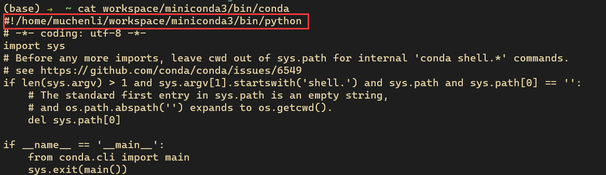

## Linux
### Sample bashrc
[Sample](./.bashrc)

### Setup ssh config 
```bash
Host *
    ControlMaster auto
    ControlPath ~/.ssh/sockets/%r@%h-%p
    ControlPersist 1800
    ServerAliveInterval 60
    ServerAliveCountMax 30
```
remember to mkdir ~/.ssh/sockets

### Turning On Or Off Fn Mode In Ubuntu Linux 
```
echo 2 | sudo tee /sys/module/hid_apple/parameters/fnmode
```
https://www.hashbangcode.com/article/turning-or-fn-mode-ubuntu-linux

### Setup a new device partition
https://www.digitalocean.com/community/tutorials/how-to-partition-and-format-storage-devices-in-linux

### How to migrate an existing miniconda
This comes in some server where your home directory is almost full.
mv the ~/Miniconda or ~/Conda environments to some place else and modify the first line in say:



### Install/Upgrade your CUDA
Strictly follow this
https://docs.nvidia.com/cuda/cuda-installation-guide-linux/index.html#ubuntu-installation

Reboot to make nvidia-smi work.


### 
