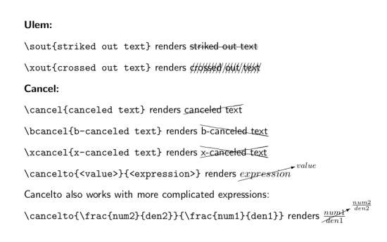

# Latex cheat sheet

## Figures and Tables
Cetering of figures
https://www.overleaf.com/learn/latex/Positioning_of_Figures

## Notations

## Docs
### Deletetion lines


---
## Useful staffs
### Import colorful codes
Checkout [overleaf instructions](https://www.overleaf.com/learn/latex/code_listing#Code_styles_and_colours) to use formated codes.
```latex
\documentclass{article}
\usepackage[utf8]{inputenc}

\usepackage{listings}
\usepackage{xcolor}

\definecolor{codegreen}{rgb}{0,0.6,0}
\definecolor{codegray}{rgb}{0.5,0.5,0.5}
\definecolor{codepurple}{rgb}{0.58,0,0.82}
\definecolor{backcolour}{rgb}{0.95,0.95,0.92}

\lstdefinestyle{mystyle}{
    backgroundcolor=\color{backcolour},   
    commentstyle=\color{codegreen},
    keywordstyle=\color{magenta},
    numberstyle=\tiny\color{codegray},
    stringstyle=\color{codepurple},
    basicstyle=\ttfamily\footnotesize,
    breakatwhitespace=false,         
    breaklines=true,                 
    captionpos=b,                    
    keepspaces=true,                 
    numbers=left,                    
    numbersep=5pt,                  
    showspaces=false,                
    showstringspaces=false,
    showtabs=false,                  
    tabsize=2
}

\lstset{style=mystyle}

\begin{document}
The next code will be directly imported from a file

\lstinputlisting[language=Octave]{BitXorMatrix.m}
\end{document}
```

To use it
```latex
\begin{lstlisting}[language=Python, caption=Python example]
    Your code
\end{lstlisting}
```
It looks like this:


## Personal commands
```latex
% declare normal emphasize for instead of undelining
\usepackage[normalem]{ulem}
% add comment using \muchen
\newcommand {\muchen}[1]{{\color{blue}#1}}
% do modification by using \md{old_content}{new_content}
\newcommand {\md}[2]{\sout{#1}{ \color{blue}#2}}
```
### latex 使用 enumitem 宏包调整上下左右缩进间距，标签样式
https://blog.csdn.net/robert_chen1988/article/details/83179571
